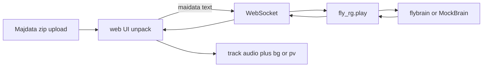
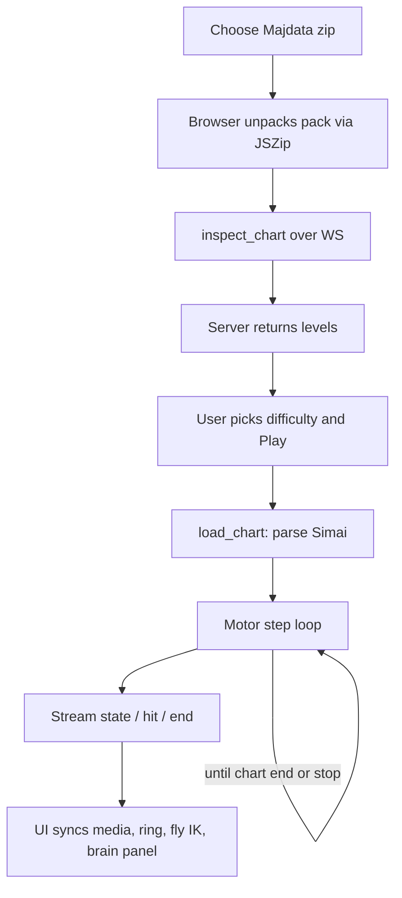
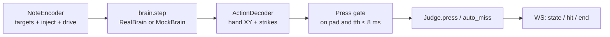
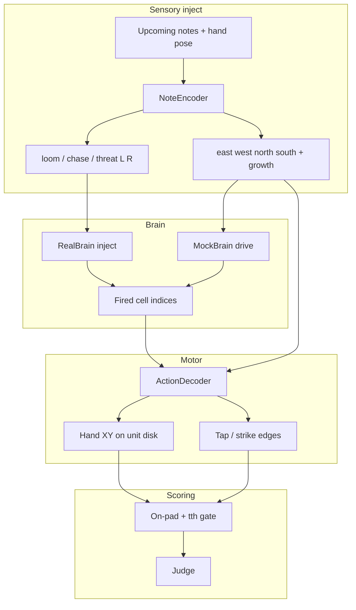
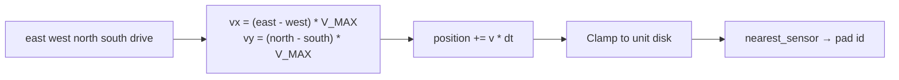
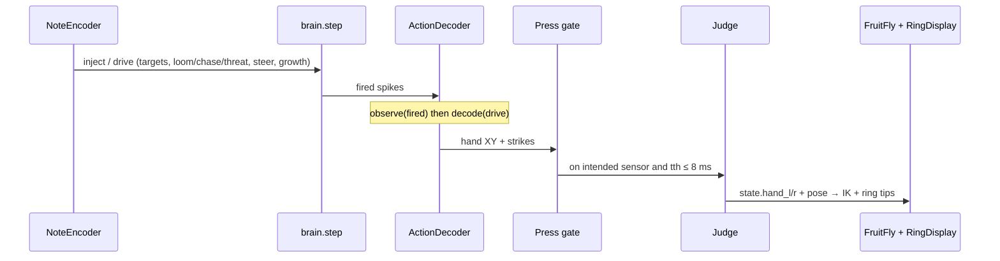

# fly-rg

Closed-loop maimai-style rhythm play driven by a fruit-fly connectome ([fly.ai](https://github.com/alextitonis/fly.ai) / `flybrain`). You upload a **Majdata chart zip** in the browser; the fly brain plays it on a DX sensor cabinet while a neural activity panel runs on the right.

Chart packs match [MajdataView_web](https://github.com/TeamMajdata/MajdataView_web): `maidata.txt`, `track.ogg` or `track.mp3`, `bg.png` or `bg.jpg`, optional `pv.mp4` (example: `charts/zip/teratera.zip`).

## Architecture



Media stays in the browser (blob URLs). Only `maidata.txt` is sent to the Python server.

## How it works (end to end)

From zip upload to final score:



### 1. Upload and unpack

In the browser (`web/src/chartpack.ts`), **Choose zip** runs JSZip over the pack. Names are matched case-insensitively (including files in a subfolder):

| File | Stays where |
| --- | --- |
| `maidata.txt` | Sent to Python as text |
| `track.ogg` / `.mp3` / `.wav` | Blob URL for `MediaPlayer` |
| `bg.png` / `.jpg` / … | Blob URL behind the sensor grid |
| `pv.mp4` / `.webm` | Preferred over bg when present |

Nothing except the maidata string leaves the browser.

### 2. Inspect and load

`web/src/main.ts` talks to `fly_rg.play` over WebSocket (`ws://127.0.0.1:8765`, or `?ws=host:port`):

1. **`inspect_chart`** — server runs `list_difficulties` and replies with `levels` (`inote_N` options).
2. User picks a difficulty and hits **Play**.
3. **`load_chart`** — server parses Simai (`fly_rg.chart.parse_simai`), builds a `Chart` of timed notes (taps, holds, touches, slides), then starts `_play_once`.

On load the client also gets a `chart` message (full note list) and later continuous `state` updates.

### 3. Play loop (each motor step)

`_play_once` in `fly_rg/play.py` advances simulation time from wall clock (`--speed`, `--dt`, `--look-ahead`):



1. **Encode** (`NoteEncoder`) — look ahead ~1 s of unmatched notes; assign at most one target per hand (L/R); emit visual inject (loom / chase / threat) and motor drive (east/west/north/south, growth).
2. **Brain step** — real `flybrain` gets `inject=…`; `--mock` gets a `MockBrain` drive dict and synthetic spikes.
3. **Decode** (`ActionDecoder`) — integrate Cartesian drive into hand XY on the unit disk; detect tap/strike edges from DNp-family spikes or growth.
4. **Press gate** — a hand scores only if it sits on the encoder’s intended sensor **and** time-to-hit ≤ 8 ms (`ON_PAD_TTH_S`).
5. **Judge** — `Judge.press` / `auto_miss` apply maimai DX windows and update combo / achievement.
6. **Broadcast** — `state` (~16 ms), occasional spike payloads (~50 ms), `hit` flashes, then `end` with the final score.

`stop` or disconnect cancels the run.

### 4. Scoring

`fly_rg/judge.py` mirrors DX timing and point tables:

- Tap / hold / slide-head windows: Critical ≈ 16.7 ms, Perfect 50 ms, Great 100 ms, Good 150 ms.
- Touch notes use wider early/late windows (Critical within 150 ms early; late out to ~300 ms).
- EX notes force Critical; slides track path nodes after the head press.
- DX points: TAP/TOUCH 500, HOLD/TOUCH_HOLD 1000, SLIDE 1500, BREAK 2500 (+ break bonus). Achievement is `base/max_base + 0.01 * bonus/max_bonus` (up to 101% when every break is Critical Perfect).

Hits stream as `hit` messages; the run finishes with `end.score` (combo, CP/P/G/g/M counts, achievement, accuracy).

### 5. What the UI does with the stream

| Layer | Module | Role |
| --- | --- | --- |
| Ring / sensors | `web/src/ring.ts` | Canvas playfield: pads, approaching notes, hand tips, judgment flashes |
| Cabinet + fly | `scene.ts`, `cabinet.ts`, `fly.ts` | Three.js DX cabinet; foreleg IK follows hand pose; strikes plant on glass |
| Brain panel | `brain.ts` | Layout + spike glow (display atlas, not the full connectome) |
| HUD | `hud.ts` | Score, drive meters, resources, judgment popup |
| Media | `media.ts` | Track + muted PV synced to `state.t` |

## Brain, motor, and sensors

This section is the closed-loop body: vision-style inject, descending neurons, two-hand glide, and the DX pad geometry they land on.



### Sensory inject (encoder)

`NoteEncoder` maps upcoming chart targets into fly visual-projection cell groups (and a parallel mock drive dict):

| Drive key | Cell types | Meaning in play |
| --- | --- | --- |
| `loomL` / `loomR` | LPLC1, LPLC2 | Strong approach / looming toward that side’s target |
| `threatL` / `threatR` | LC4, LC6 | Threat-like emphasis |
| `chaseL` / `chaseR` | LC10a, LC11, LC16 | Pursuit / chase toward the target |

Motor channels on the same step:

- **Steer** — `east/west/north/south{L,R}` from chord velocity toward the assigned sensor (capped at `V_MAX = 8` unit-disk units/s).
- **Tap pulse** — `growth{L,R}` near hit time / when already on pad within the 8 ms gate.
- **Idle** — before/after chart activity, hands rest toward `REST_HOME` (`A6` left, `A3` right).

For a real connectome, inject entries are `(cell_indices, amount)` for `FlyBrain.step`. Mock mode skips connectome inject and feeds the drive dict straight into `MockBrain`.

### Brain backends

| Backend | When | Behavior |
| --- | --- | --- |
| `RealBrain` | `pip install flybrain && flybrain download`, then `--device cuda` (or cpu) | Thin wrapper around `flybrain.FlyBrain`; steps MaleCNS with inject |
| `MockBrain` | `--mock` (default demo path) | Deterministic pseudo-spikes proportional to drive; same `cells` / `step` surface |

Descending groups involved in the code path:

| Role | Types |
| --- | --- |
| Steer inject map | DNa01–DNa04 (also aliased from east/west/north/south on the mock) |
| Tap inject | DNp01–DNp03, DNb01–DNb02 |

The right-hand **brain panel** (`NeuronAtlas` / `BrainView`) is a compact display layout (~720 neurons) driven by packed spike indices for visualization. It is not a full render of MaleCNS.

### Motor movement (decoder)

Hand motion is Cartesian glide on the unit disk, integrated every motor `dt`:



Important split in the current control loop:

- **XY glide** comes from encoder steer drive (open-loop toward note geometry), not from decoding DNa spike rates into velocity.
- **Tap / strike** can come from rising edges on DNp-family spike counts **or** from `growth` crossing a threshold (`TAP_GROWTH`), with a short cooldown.
- Holds / in-progress slides force contact strike while the hand occupies the path sensors.

`_want_press` then requires occupancy on the intended sensor plus `tth ≤ 8 ms` before `Judge.press` runs. That is what turns motor contact into a scored hit.

### Sensor geometry

Shared between Python (`fly_rg/sensors.py`) and the web client (`web/src/sensors.ts`), matching Majdata `GetAreaPos` on a unit disk (y up):

| Zone | Radius |
| --- | --- |
| C | 0 (center) |
| B | 0.479 |
| E | 0.625 |
| A / D | 0.854 |

Occupancy order for `nearest_sensor`: **C → B → E → A → D** (gaps return no pad). A-buttons 1–8 map to `A1`–`A8`. Tap landings for A use outer radius 1.0; touch pads use zone centers. See `sources/README.md` for the MajdataView provenance of these numbers.

### Data flow (one step)



## Install

- Python 3.10+
- Node.js 18+

```bash
pip install -e ".[dev]"
cd web && npm i
```

Optional real connectome:

```bash
pip install flybrain && flybrain download
```

## Play (main path)

Terminal 1:

```bash
python -m fly_rg.play --mock
```

The server listens on `ws://127.0.0.1:8765` — override with `--host` / `--port`, and point the web client elsewhere with `?ws=host:port` on the page URL. A `fly-rg` console script is installed alongside the module (`--speed`, `--look-ahead`, `--dt` also available).

Terminal 2:

```bash
cd web && npm run dev
```

Open http://127.0.0.1:5173:

1. **Choose zip** (e.g. `charts/zip/teratera.zip`)
2. Pick a **difficulty** (`inote_N`)
3. **Play**

Status should read `open`. Notes move on the cabinet; jacket/PV sits under the sensor grid; track audio syncs to simulation time.

Real brain (after download):

```bash
python -m fly_rg.play --device cuda
```

## Zip layout

Files may sit in a subfolder. Names are case-insensitive; only `maidata.txt` is required:

| File | Role |
| --- | --- |
| `maidata.txt` | Simai chart |
| `track.ogg` / `track.mp3` / `track.wav` | Audio (silent without it) |
| `bg.png` / `bg.jpg` / `bg.jpeg` / `bg.webp` | Jacket behind sensors |
| `pv.mp4` / `pv.webm` | Optional video behind sensors (preferred over bg when present) |

## Chart support

Full Simai ([notation reference](https://w.atwiki.jp/simai/pages/1003.html) / [MajSimai](https://github.com/TeamMajdata/MajSimai)):

- BPM `(n)`, beat divisor `{n}` / absolute `{#sec}`
- TAP / BREAK / EX / mine / star (`$` `$$`) / EACH (`/` and compact `12`)
- HOLD / BREAK HOLD / EX HOLD (including short `1h`)
- TOUCH / TOUCH HOLD / hanabi (`f`) on A–E
- Slides: `- > < ^ v V p q s z pp qq w`, chained, multi (`*`), wifi, `@` `?` `!` heads
- Duration forms `[n:m]`, `[#sec]`, `[bpm#…]`, `[<sec>##…]`

Optional offline JSON export: `tools/majsimai_export` (timed-note schema).

## Credits

- [fly.ai](https://github.com/alextitonis/fly.ai) (MIT) and MaleCNS via `flybrain`
- [Majdata](https://github.com/TeamMajdata) / [MajdataView_web](https://github.com/TeamMajdata/MajdataView_web) / [MajSimai](https://github.com/TeamMajdata/MajSimai)
- MaleCNS connectome data: CC BY 4.0

## License

MIT. See [LICENSE](LICENSE).
