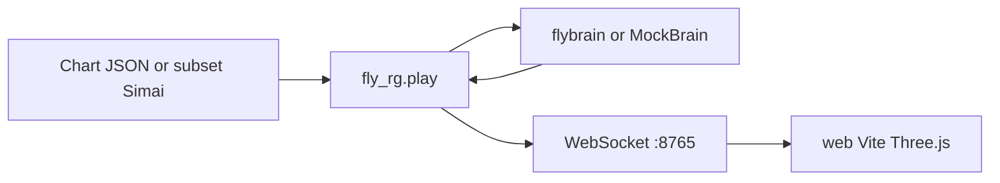

# fly-rg

Closed-loop maimai-style rhythm play driven by a fruit-fly connectome ([fly.ai](https://github.com/alextitonis/fly.ai) / `flybrain`). Notes become sensory inject; descending neurons become button presses; a Three.js cabinet scene mirrors the run over WebSocket.

## Architecture



Optional offline path: `tools/majsimai_export` converts full-ish maidata toward the same JSON the Python subset loader already understands for taps/holds.

## Install

- Python 3.10+
- Node.js 18+ (for `web/`)

```bash
pip install -e .
```

Optional real connectome (large download):

```bash
pip install flybrain && flybrain download
```

## Quickstart (mock, no GPU / connectome)

```bash
pip install -e ".[dev]"
python -m fly_rg.play --chart charts/demo/maidata.txt --mock --port 8765
cd web && npm i && npm run dev
```

Open the Vite URL, connect to `ws://127.0.0.1:8765`, and watch the mock brain tap the demo chart.

## Real brain

Omit `--mock` after `flybrain download`. Prefer GPU when available:

```bash
python -m fly_rg.play --chart charts/demo/chart.json --device cuda --port 8765
```

Default device selection follows flybrain / fly_rg (typically auto or CPU if CUDA is unavailable). Pass `--device cpu` to force CPU.

## Chart formats

Shared timed-note JSON:

```json
{
  "title": "",
  "artist": "",
  "offset": 0.0,
  "notes": [
    { "t": 0.0, "button": 1, "type": "tap", "end": null }
  ]
}
```

Subset Simai (`maidata.txt`): `&title=`, `&artist=`, `&first=`, `(bpm)`, `{n}`, taps `1`-`8`, break `1b`, holds `1h[x:y]` / `1h[#seconds]`, each `/`. Slides and touch are out of scope for the Python subset parser.

Demo chart: `charts/demo/maidata.txt` and matching `charts/demo/chart.json`.

## MajSimai export tool

Optional .NET 8 CLI under `tools/majsimai_export`. It ships a **self-contained subset exporter** (builds without MajSimai). See that folder's README for build/run and how to ProjectReference a local [MajSimai](https://github.com/TeamMajdata/MajSimai) clone later for slides/touch. Do not vendor MajSimai into this repo (upstream has no license file).

```bash
cd tools/majsimai_export
dotnet build -c Release
dotnet run -c Release -- ../../charts/demo/maidata.txt -o ../../charts/demo/chart.json
```

Omit `--difficulty` to use the lowest `&inote_N=` chart (demo uses `&inote_1=`).
## Credits

- [fly.ai](https://github.com/alextitonis/fly.ai) (MIT) and the MaleCNS connectome via `flybrain`
- [Majdata](https://github.com/TeamMajdata) / [MajSimai](https://github.com/TeamMajdata/MajSimai) for Simai chart tooling (optional bridge only)
- MaleCNS connectome data: CC BY 4.0

## License

MIT. See [LICENSE](LICENSE).
