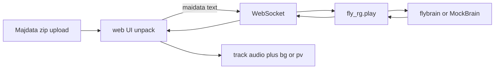

# fly-rg

Closed-loop maimai-style rhythm play driven by a fruit-fly connectome ([fly.ai](https://github.com/alextitonis/fly.ai) / `flybrain`). You upload a **Majdata chart zip** in the browser; the fly brain plays it on a DX sensor cabinet while a neural activity panel runs on the right.

Chart packs match [MajdataView_web](https://github.com/TeamMajdata/MajdataView_web): `maidata.txt`, `track.ogg` or `track.mp3`, `bg.png` or `bg.jpg`, optional `pv.mp4` (example: `charts/zip/teratera.zip`).

## Architecture



Media stays in the browser (blob URLs). Only `maidata.txt` is sent to the Python server.

## Install

- Python 3.10+
- Node.js 18+

```bash
pip install -e ".[dev]"
cd web && npm i
```

Optional real connectome:

```bash
pip install flybrain && flybrain download
```

## Play (main path)

Terminal 1:

```bash
python -m fly_rg.play --mock
```

Terminal 2:

```bash
cd web && npm run dev
```

Open http://127.0.0.1:5173:

1. **Choose zip** (e.g. `charts/zip/teratera.zip`)
2. Pick a **difficulty** (`inote_N`)
3. **Play**

Status should read `open`. Notes move on the cabinet; jacket/PV sits under the sensor grid; track audio syncs to simulation time.

Real brain (after download):

```bash
python -m fly_rg.play --device cuda
```

## Zip layout

Files may sit in a subfolder. Required names (case-insensitive):

| File | Role |
| --- | --- |
| `maidata.txt` | Simai chart |
| `track.ogg` / `track.mp3` | Audio |
| `bg.png` / `bg.jpg` | Jacket behind sensors |
| `pv.mp4` | Optional video behind sensors (preferred over bg when present) |

## Chart support

Full Simai ([notation reference](https://w.atwiki.jp/simai/pages/1003.html) / [MajSimai](https://github.com/TeamMajdata/MajSimai)):

- BPM `(n)`, beat divisor `{n}` / absolute `{#sec}`
- TAP / BREAK / EX / mine / star (`$` `$$`) / EACH (`/` and compact `12`)
- HOLD / BREAK HOLD / EX HOLD (including short `1h`)
- TOUCH / TOUCH HOLD / hanabi (`f`) on A–E
- Slides: `- > < ^ v V p q s z pp qq w`, chained, multi (`*`), wifi, `@` `?` `!` heads
- Duration forms `[n:m]`, `[#sec]`, `[bpm#…]`, `[t##…]`

Optional offline JSON export: `tools/majsimai_export` (timed-note schema).

## Credits

- [fly.ai](https://github.com/alextitonis/fly.ai) (MIT) and MaleCNS via `flybrain`
- [Majdata](https://github.com/TeamMajdata) / [MajdataView_web](https://github.com/TeamMajdata/MajdataView_web) / [MajSimai](https://github.com/TeamMajdata/MajSimai)
- MaleCNS connectome data: CC BY 4.0

## License

MIT. See [LICENSE](LICENSE).
